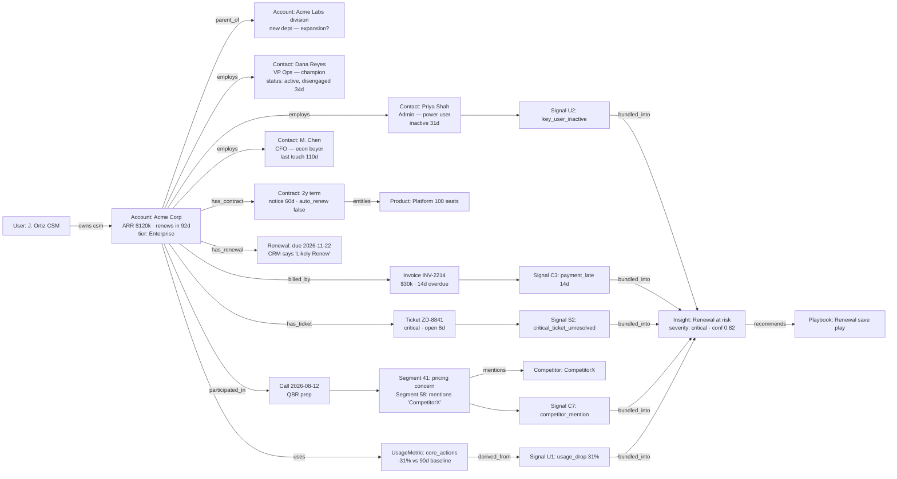

# 8. Canonical Data Model and Graph Design

## 8.1 Global conventions

Applied to **every** entity unless noted:

| Convention | Standard |
|---|---|
| Primary key | `id UUID` (v7, time-ordered) |
| Tenant key | `tenant_id UUID NOT NULL` — first column of every composite index; Postgres **RLS policy** `tenant_id = current_setting('app.tenant_id')::uuid` on every table |
| Soft delete | `deleted_at TIMESTAMPTZ NULL` + partial indexes `WHERE deleted_at IS NULL`; hard delete via retention/DSR purge jobs only |
| Timestamps | `event_at` (when it happened in the source world) vs `ingested_at` (when we received it) vs `created_at/updated_at` (row lifecycle). Never conflated. |
| Provenance | `source_system TEXT`, `source_record_id TEXT`, `source_url TEXT NULL`, `sync_run_id UUID` on all ingested entities; unique `(tenant_id, source_system, source_record_id)` |
| Confidence | `confidence NUMERIC(3,2)` on all derived/resolved entities |
| PII classification | column-level tags in schema registry: `none | business_contact | pii_extended | sensitive_content`; drives masking, retention, DSR |
| Permission boundary | row scope = account-derived scopes (doc 4); column scope = PII/field classes |
| Retention | per-class tenant policy: raw text content (transcripts/tickets/emails) default 24 months; derived signals/scores 36 months; audit 7 years (see doc 12) |

## 8.2 Entity catalog

### Core operational tables (DDL for the load-bearing ones)

```sql
CREATE TABLE account (
  id            UUID PRIMARY KEY,
  tenant_id     UUID NOT NULL,
  name          TEXT NOT NULL,
  domains       TEXT[] NOT NULL DEFAULT '{}',
  industry      TEXT, segment TEXT, tier TEXT, territory TEXT,
  lifecycle_stage TEXT NOT NULL DEFAULT 'prospect',      -- enum via check
  arr_cents     BIGINT,            -- canonical, per source-of-truth rules
  currency      CHAR(3) DEFAULT 'USD',
  renewal_date  DATE,
  plan          TEXT,
  parent_account_id UUID REFERENCES account(id),
  owner_csm_id  UUID REFERENCES app_user(id),
  owner_ae_id   UUID REFERENCES app_user(id),
  exec_sponsor_id UUID REFERENCES app_user(id),
  attributes    JSONB NOT NULL DEFAULT '{}',             -- tenant custom fields
  deleted_at    TIMESTAMPTZ,
  created_at TIMESTAMPTZ NOT NULL DEFAULT now(),
  updated_at TIMESTAMPTZ NOT NULL DEFAULT now()
);
CREATE INDEX ON account (tenant_id, renewal_date) WHERE deleted_at IS NULL;
CREATE INDEX ON account (tenant_id, owner_csm_id) WHERE deleted_at IS NULL;
CREATE INDEX ON account USING gin (tenant_id, domains);

-- Canonical-field provenance: which source supplied each governed field
CREATE TABLE account_field_provenance (
  id UUID PRIMARY KEY, tenant_id UUID NOT NULL,
  account_id UUID NOT NULL REFERENCES account(id),
  field TEXT NOT NULL,
  chosen_source TEXT NOT NULL, chosen_value JSONB NOT NULL,
  candidates JSONB NOT NULL,       -- [{source, value, as_of}]
  rule_version INT NOT NULL,
  conflict BOOLEAN NOT NULL DEFAULT false,
  as_of TIMESTAMPTZ NOT NULL,
  UNIQUE (tenant_id, account_id, field)
);

CREATE TABLE source_link (      -- identity resolution results
  id UUID PRIMARY KEY, tenant_id UUID NOT NULL,
  entity_type TEXT NOT NULL,    -- account|contact|opportunity|...
  entity_id UUID NOT NULL,
  source_system TEXT NOT NULL, source_record_id TEXT NOT NULL,
  match_method TEXT NOT NULL,   -- explicit|domain|email_domain|fuzzy_name|human
  confidence NUMERIC(3,2) NOT NULL,
  status TEXT NOT NULL DEFAULT 'linked',  -- linked|suggested|rejected
  linked_by UUID NULL,          -- user id when human
  created_at TIMESTAMPTZ NOT NULL DEFAULT now(),
  UNIQUE (tenant_id, source_system, source_record_id, entity_type)
);

CREATE TABLE signal (
  id UUID PRIMARY KEY, tenant_id UUID NOT NULL,
  account_id UUID NOT NULL REFERENCES account(id),
  opportunity_id UUID NULL,
  signal_type TEXT NOT NULL,          -- taxonomy id, e.g. 'usage_drop_vs_baseline'
  detector_class TEXT NOT NULL,       -- det|stat|ml|llm|hybrid
  detector_version TEXT NOT NULL,
  semantic_key TEXT NOT NULL,         -- dedupe discriminator
  severity TEXT NOT NULL, confidence NUMERIC(3,2) NOT NULL,
  magnitude JSONB,                    -- signal-specific payload
  rationale TEXT NOT NULL,
  window_start TIMESTAMPTZ, window_end TIMESTAMPTZ,
  occurrence_count INT NOT NULL DEFAULT 1,
  state TEXT NOT NULL DEFAULT 'active',   -- active|resolved|snoozed|suppressed
  snooze_until TIMESTAMPTZ, snooze_reason TEXT,
  requires_review BOOLEAN NOT NULL DEFAULT false,
  reviewed_by UUID, reviewed_at TIMESTAMPTZ, review_outcome TEXT,
  first_detected_at TIMESTAMPTZ NOT NULL,
  last_evaluated_at TIMESTAMPTZ NOT NULL,
  deleted_at TIMESTAMPTZ,
  UNIQUE (tenant_id, account_id, signal_type, semantic_key)
);
CREATE INDEX ON signal (tenant_id, account_id, state);
CREATE INDEX ON signal (tenant_id, severity, state, last_evaluated_at);

CREATE TABLE evidence_object (
  id UUID PRIMARY KEY, tenant_id UUID NOT NULL,
  kind TEXT NOT NULL,        -- crm_field|usage_metric|ticket|transcript_span|document|billing_event|email_meta|computed_metric
  source_system TEXT NOT NULL, source_record_id TEXT NOT NULL,
  source_url TEXT,
  account_id UUID, 
  content_ref JSONB NOT NULL,       -- pointer: table/id, object-store key + span offsets, or metric query descriptor
  excerpt TEXT,                     -- only when policy allows storage of verbatim spans
  event_at TIMESTAMPTZ NOT NULL, ingested_at TIMESTAMPTZ NOT NULL,
  freshness_at TIMESTAMPTZ NOT NULL,      -- last verified current
  sensitivity TEXT NOT NULL DEFAULT 'business',
  hash TEXT NOT NULL                       -- content hash for tamper-evidence
);

CREATE TABLE evidence_citation (
  id UUID PRIMARY KEY, tenant_id UUID NOT NULL,
  evidence_id UUID NOT NULL REFERENCES evidence_object(id),
  claim_owner_type TEXT NOT NULL,   -- signal|insight|score_change|report_claim|answer
  claim_owner_id UUID NOT NULL,
  claim_text TEXT NOT NULL,
  claim_class TEXT NOT NULL,        -- observed_fact|model_prediction|ai_interpretation|recommendation
  verification_status TEXT NOT NULL DEFAULT 'verified',  -- verified|unsupported|stale
  created_at TIMESTAMPTZ NOT NULL DEFAULT now()
);
CREATE INDEX ON evidence_citation (tenant_id, claim_owner_type, claim_owner_id);

CREATE TABLE score (
  id UUID PRIMARY KEY, tenant_id UUID NOT NULL,
  account_id UUID NOT NULL,
  score_type TEXT NOT NULL,          -- health|renewal_risk|expansion|...
  score_version TEXT NOT NULL,
  value NUMERIC(5,2) NOT NULL,
  confidence_low NUMERIC(5,2), confidence_high NUMERIC(5,2),
  reliability NUMERIC(3,2) NOT NULL, -- data-reliability coupling
  as_of TIMESTAMPTZ NOT NULL,
  inputs_hash TEXT NOT NULL,         -- reproducibility
  UNIQUE (tenant_id, account_id, score_type, as_of)
);
CREATE TABLE score_component (
  id UUID PRIMARY KEY, tenant_id UUID NOT NULL,
  score_id UUID NOT NULL REFERENCES score(id),
  component TEXT NOT NULL, raw_value JSONB,
  weight NUMERIC(5,4), contribution NUMERIC(6,3),  -- signed points
  baseline JSONB, evidence_ids UUID[]
);

CREATE TABLE insight (
  id UUID PRIMARY KEY, tenant_id UUID NOT NULL,
  account_id UUID NOT NULL, opportunity_id UUID,
  kind TEXT NOT NULL,             -- risk|opportunity|data_quality|forecast
  title TEXT NOT NULL, narrative TEXT NOT NULL,
  severity TEXT, confidence NUMERIC(3,2),
  arr_at_stake_cents BIGINT,
  state TEXT NOT NULL DEFAULT 'detected',   -- lifecycle doc 6 D
  state_reason TEXT, owner_id UUID,
  signal_ids UUID[] NOT NULL,
  model_run_id UUID,              -- provenance of generation
  outcome TEXT, outcome_at TIMESTAMPTZ, root_cause TEXT[],
  created_at TIMESTAMPTZ NOT NULL DEFAULT now(), updated_at TIMESTAMPTZ NOT NULL DEFAULT now()
);

CREATE TABLE audit_event (
  id UUID PRIMARY KEY, tenant_id UUID NOT NULL,
  actor_type TEXT NOT NULL,       -- user|system|connector|model
  actor_id TEXT NOT NULL,
  action TEXT NOT NULL,           -- e.g. auth.login, export.create, writeback.execute
  object_type TEXT, object_id TEXT,
  payload JSONB NOT NULL DEFAULT '{}',   -- redacted per policy
  ip INET, user_agent TEXT,
  occurred_at TIMESTAMPTZ NOT NULL DEFAULT now(),
  prev_hash TEXT NOT NULL, hash TEXT NOT NULL   -- hash chain, tamper-evident
);
-- append-only: no UPDATE/DELETE grants; hash = H(prev_hash || row)
```

### Full entity list (compact spec)

| Entity | Key fields beyond conventions | Relationships | Notes / PII |
|---|---|---|---|
| `tenant` | name, plan, region, settings JSONB, status | root | Residency region pins storage |
| `app_user` | email, name, idp_subject, status, last_login_at | ↔ roles, teams | PII: business_contact |
| `role` / `user_role` | role key, custom capability set / user↔role + scope JSONB | | scope = segment/territory/named accounts |
| `team` / `team_member` | name, type (CS pod, sales team) | manager chain for `team` scope | |
| `account_hierarchy` | (implicit via parent_account_id) + `hierarchy_source`, confidence | account self-ref | cycle-checked |
| `contact` | name, title, email, phone?, status(active/departed/suspected_departed), seniority | account | PII: business_contact (+extended if phone) |
| `stakeholder_role` | contact_id, role(champion/econ_buyer/exec_sponsor/user/detractor), strength, as_of, source | contact, account | temporal validity |
| `account_owner_history` | account, user, role, from/to | | supports "owner changed" signals |
| `opportunity` | name, amount_cents, stage, forecast_category, close_date, type(new/renewal/expansion), next_step, owner | account | |
| `opportunity_stage_history` | opp, from_stage, to_stage, at, actor | | fuels aging/slip signals |
| `contract` | start/end, term, auto_renew bool, notice_days, tcv_cents, status, doc_ref | account | sensitivity: commercial_sensitive |
| `contract_line_item` | product_id, qty, unit_price_cents, entitlement link | contract | |
| `renewal` | contract_id, due_date, stage, owner, outcome, outcome_arr_delta_cents | contract, account | central to wedge |
| `invoice` / `payment` | amounts, due_at, paid_at, status, dispute flags | account, contract | |
| `subscription` | billing-system subscription state, period end, MRR | account | |
| `product` / `product_entitlement` | catalog / account×product qty, limits | | |
| `usage_event` (raw, warehouse-side) | user_ref, event_name, ts, properties | account via resolution | high volume — lands in warehouse, not Postgres |
| `usage_metric_daily` | account_id, metric, date, value, user_count | account | serving aggregates in Postgres |
| `support_ticket` | subject, priority, status, category, opened/resolved_at, escalated, requester contact | account | content: sensitive_content |
| `support_message` | ticket_id, author, body_ref, sent_at | ticket | body in object store |
| `meeting_call` | title, started_at, duration, participants[], source, recording_ref | account, contacts | |
| `transcript_segment` | call_id, idx, speaker, t_start/t_end, text_ref, embedding_ref | meeting_call | sensitive_content; span-addressable for citations |
| `email_message_meta` | thread id, from/to hashes, subject?, sent_at, direction | account, contacts | **body excluded by default**; `email_body` separate opt-in table w/ consent record |
| `task` | title, assignee, due, status, playbook_step_id?, external_refs (SFDC/Jira ids) | insight, account | |
| `playbook` / `playbook_step` | trigger criteria, steps, SLAs, exit criteria, version | | |
| `action` | insight_id, type, status(suggested/accepted/rejected/completed), approved_by, executed payload ref | insight, task | approval-gated externals |
| `forecast_snapshot` | scope(account/opp/quarter), predicted, range, method_version, as_of | | immutable snapshots for calibration |
| `account_plan` | objectives JSONB, risks, plays, status, approved_by | account | |
| `qbr` | date, attendees, deck_ref, commitments JSONB | account | |
| `data_source` | connector type, auth ref, scopes granted, status, region | tenant | |
| `sync_run` | source, started/ended, mode(backfill/incr), records, errors JSONB, watermark | data_source | replayable |
| `data_quality_issue` | class, severity, affected_refs, impact, state, assignee, resolution | | links to degraded scores |
| `ai_model_run` | task type, model id+version, prompt_version, input_refs hash, output ref, tokens, latency, cost, validation status | | every LLM/ML invocation |
| `prompt_version` | task, template hash, changelog, evaluated_at, eval scores | | registry |
| `evaluation_result` | suite, case, metric, value, model_run linkage | | CI-gated |
| `feedback_event` | subject(insight/answer/report), verdict enum, text, user | | feeds learning |
| `notification` | channel, target, subject ref, sent_at, delivery status | | |
| `integration_credential_ref` | KMS key ref, vault path, rotation_at | data_source | secrets never in DB |
| `consent_record` | scope (e.g. email_body_ingestion), granted_by, granted_at, revoked_at, terms_version | tenant/data_source | |
| `retention_policy` | data_class, ttl_days, legal_hold flag | tenant | |
| `feature_flag` | key, rules | tenant | |
| `billing_entitlement` (RIG's own) | plan, limits (accounts, sources, seats), usage counters | tenant | drives packaging |

## 8.3 Graph representation

**Decision: model the graph in Postgres (nodes/edges tables + recursive CTEs), not a graph database, until traversal depth or scale demands otherwise.** Rationale in doc 13 §Graph. The graph is a *view over canonical entities* — entities are the source of truth; edges add typed, temporal, confidence-carrying relationships.

```sql
CREATE TABLE graph_edge (
  id UUID PRIMARY KEY, tenant_id UUID NOT NULL,
  src_type TEXT NOT NULL, src_id UUID NOT NULL,
  dst_type TEXT NOT NULL, dst_id UUID NOT NULL,
  edge_type TEXT NOT NULL,
  properties JSONB NOT NULL DEFAULT '{}',
  confidence NUMERIC(3,2) NOT NULL DEFAULT 1.0,
  source_system TEXT NOT NULL,          -- provenance
  valid_from TIMESTAMPTZ NOT NULL,
  valid_to TIMESTAMPTZ,                 -- temporal validity; NULL = current
  created_at TIMESTAMPTZ NOT NULL DEFAULT now()
);
CREATE INDEX ON graph_edge (tenant_id, src_type, src_id, edge_type) WHERE valid_to IS NULL;
CREATE INDEX ON graph_edge (tenant_id, dst_type, dst_id, edge_type) WHERE valid_to IS NULL;
```

**Node types:** Account, Contact, User(internal), Opportunity, Contract, Renewal, Invoice, Subscription, Product, Ticket, Meeting/Call, TranscriptSegment, UsageMetric, Signal, Insight, Task, Plan, Document.

**Edge types (principal):**

| Edge | Src → Dst | Properties | Typical confidence |
|---|---|---|---|
| `parent_of` | Account → Account | hierarchy_source | 1.0 CRM / 0.7 inferred |
| `employs` | Account → Contact | title, status | 1.0 / decays on bounce |
| `plays_role` | Contact → Account | role, strength | varies; temporal |
| `owns` | User → Account/Opportunity | role (csm/ae/exec_sponsor) | 1.0 |
| `has_opportunity` / `has_contract` / `has_renewal` / `billed_by` | Account → * | | 1.0 |
| `entitles` | Contract → Product | qty | 1.0 |
| `uses` | Account → Product | adoption metrics ref | 1.0 |
| `participated_in` | Contact → Meeting/Ticket | speaker role | 1.0 / 0.8 name-matched |
| `mentions` | TranscriptSegment → Product/Competitor/Topic | span, context label | LLM conf |
| `evidences` | EvidenceObject → Signal/Insight/Claim | claim class | 1.0 |
| `derived_from` | Signal/Score → EvidenceObject/Metric | detector version | 1.0 |
| `recommends` | Insight → Action/Playbook | rank | model conf |
| `escalated_to` | Insight → User | SLA | 1.0 |

**Update mechanics:** connectors upsert entities → resolution service links/creates nodes and closes/opens temporal edges (never destructive updates: an edge change closes `valid_to` and inserts a new row, giving full graph history) → downstream feature computation subscribes to edge/entity change events on the bus.

**How the application uses the graph:**
- *Relationship-strength features:* count/recency/seniority-weighted `plays_role` + `participated_in` edges → multi-threading and exec-coverage metrics.
- *Blast-radius queries:* champion departs → traverse `plays_role(champion)` edges to find all affected accounts/opps.
- *Evidence assembly:* insight → `evidences` edges → renderable citations.
- *Hierarchy rollups:* recursive CTE over `parent_of`.
- *Investigation copilot:* semantic layer compiles NL questions into parameterized traversals (bounded depth ≤3).

## 8.4 Example: Acme Corp canonical graph (abridged)



Full structured payloads for this example: [doc 20](20-acme-corp-walkthrough.md).
