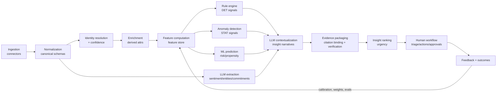

# 9. AI/ML Architecture and Evaluation Framework

## 9.0 Principles (enforced in code, not aspiration)

1. **Deterministic before statistical before ML before LLM.** Router checks: can a rule answer? a metric query? a calibrated model? Only then an LLM.
2. **LLM output is schema-validated** (JSON Schema, retry-on-invalid ≤2, then fail closed to "needs review").
3. **Citations/provenance on all material claims**; citation IDs validated against the evidence store before persist/render.
4. **Extraction ≠ interpretation ≠ recommendation** — three separate model tasks with separate prompts, versions, and review policies; outputs composed, never conflated.
5. **No training on tenant data without contractual permission**; per-tenant models never share weights or embeddings across tenants; prompts never include other tenants' data (enforced by tenant-scoped retrieval clients whose constructors require a tenant context).
6. **No causal claims from correlation; no unsupported forecasts;** all outputs labeled `observed_fact | model_prediction | ai_interpretation | recommendation`.
7. **Calibrated, explainable confidence**; high-impact outputs (exec-facing, write-backs) require human review.

## 9.A Signal pipeline



Operational properties: every stage idempotent and replayable (event-sourced from raw landing zone); late data re-triggers downstream recompute for affected accounts; each stage stamps versions so any insight is reproducible from `(inputs_hash, detector_version, prompt_version, model_id)`.

## 9.B Feature store

Postgres-backed feature tables (MVP) with registry metadata (name, owner, definition SQL/dbt model, freshness SLA, versions); promote to a dedicated store (Feast) only if/when online-offline skew bites (doc 13).

| Category | Example features |
|---|---|
| Usage trends | `usage_14d_vs_90d_ratio`, seasonality-adjusted slope, normalized by seats/contract size/segment baseline; per-feature-family adoption depth |
| Engagement | days-since-last-meeting, 90d meeting count, reply latency, 2-way-thread count |
| Stakeholders | map completeness %, seniority coverage (has exec / econ buyer), champion count, champion engagement index, single-thread flag |
| Support | open weighted-severity load, oldest-critical age, 60d category recurrence, ticket sentiment trend |
| Billing | days-past-due, 12m payment punctuality, failed-payment count, downgrade events |
| Contract/renewal | days-to-renewal, days-to-notice, auto-renew flag, term length, discount depth |
| Opportunity hygiene | next-step presence/quality score, stage age percentile, activity recency, slip count, amount cross-system delta |
| Conversation | 30/90d sentiment mean & trend, competitor-mention count by context, pricing-concern flag |
| Onboarding | milestone completion %, time-in-stage vs. cohort P75 |
| History/cohort | prior renewal outcomes, tenure, expansion history; tenant cohort base rates |
| Data quality | per-source freshness hours, completeness %, conflict count — **feeds reliability score and confidence degradation** |

## 9.C Scores

### Architecture
Composite scores = weighted normalized components; each component maps to features with segment-specific baselines. 0–100 scale for composites (appropriate: bounded, comparable); raw probabilities kept alongside for forecast math (risk score displays 0–100 but stores calibrated `p_nonrenewal`).

### Renewal-risk score (reference design)

```
components (default weights, tenant/segment tunable, sum=1.0):
  usage_trajectory        0.25   # U1/U3/U5 features
  relationship_strength   0.20   # champion status, exec coverage, threading
  support_friction        0.15
  commercial_engagement   0.15   # plan existence, renewal activity, meeting cadence
  billing_health          0.10
  sentiment_trend         0.10   # only reviewed/validated LLM outputs
  hygiene_penalty         0.05   # missing owner/plan/metadata

score_v = 100 × Σ w_i × norm_i(x_i | segment_baseline)
p_nonrenewal = calibrator(score_v, tenant)   # isotonic once labels exist; prior-based before
```

- **Directionality** displayed ("higher = riskier").
- **Segment baselines:** norm functions parameterized per segment (Enterprise vs. SMB usage norms differ); minimum cohort size 15 else fall back to tenant-global.
- **Missing data:** components with missing inputs are excluded and weights renormalized **and** reliability reduced; below 60% weight coverage → score shows "insufficient data" instead of a number. Missing ≠ bad: absence of sentiment data is not negative sentiment.
- **Confidence interval:** from input reliability + calibration residuals; displayed as band.
- **Versioning:** semantic `score_version`; changes create timeline annotations; historical scores never rewritten.
- **Drift monitoring:** PSI on component distributions monthly; calibration drift alarms.
- **Override/annotation:** doc 6 B; overrides logged and scored against outcomes.
- **Backtesting:** any weight change previews backtest on tenant history (label coverage permitting) before publish.
- **Calibration metrics:** Brier score, reliability diagrams, per-segment ECE.
- **Feedback-loop bias avoidance:** interventions are recorded as features *excluded from risk-model training targets* (else successful saves teach the model that risk signals are safe). Outcome labels are `(risk_state, intervention, outcome)` triples; evaluation uses intervention-stratified analysis; no training on dismissals alone.

Other scores follow the same pattern; component sets:
- **Health** = weighted blend of risk (inverted), adoption, relationship, support, financial — with explicit "composite of composites" lineage view.
- **Expansion propensity** = capacity, breadth/depth trend, stakeholder growth, advocacy, eligibility − obstacle penalty (open critical risk caps display at "conditional").
- **Relationship strength** = threading count/seniority/recency weighted graph features.
- **Adoption** = breadth × depth × frequency vs. segment norms.
- **Support friction** = severity-weighted open load + recurrence + resolution-time trend + support sentiment.
- **Financial health** = punctuality, failures/disputes, downgrade events, payment-terms stress.
- **Data reliability** = freshness × completeness × conflict-freedom across sources feeding this account (meta-score, gates the others).
- **Onboarding success** = milestone %, time-to-value vs. cohort, early usage ramp.
- **Forecast confidence** = evidence-vs-category consistency + hygiene + historical rep/stage calibration.

## 9.D LLM tasks

Common contract for every task:

| Aspect | Standard |
|---|---|
| Input | Minimal task-scoped context; tenant+user-authorized retrieval only; PII/redaction filters applied pre-prompt |
| Retrieval | Hybrid: structured query (semantic layer) for facts + vector/keyword search over authorized text (tenant-namespaced index) |
| Output | Strict JSON Schema; `additionalProperties:false`; enum-constrained labels |
| Citations | Every extraction/claim carries `evidence.source_record_id` + span offsets; validator rejects citations not present in the provided context (**no citation invention possible by construction** — model cites from an enumerated evidence menu with IDs, never free-form) |
| Confidence | 2-pass self-consistency agreement + logit-free heuristic bucket {0.5,0.7,0.9}; calibrated against human ratings quarterly |
| Validation | Schema → citation-existence → business rules (e.g., sentiment label requires ≥1 span) → profanity/PII leak scan |
| Failure | Invalid after 2 retries → dead-letter to human-review queue; never partial-publish |
| Review policy | Exec-facing / severity ≥ high / write-back-adjacent → human review required |
| Eval dataset | Golden set per task: 150–300 labeled examples from design partners (with consent) + synthetic; refreshed quarterly; CI regression gate |

### Task registry (inputs → outputs)

**D.1 Conversation/ticket sentiment classification**
- In: transcript segments or ticket thread (chunked), speaker roles, account context header.
- Out schema:
```json
{"type":"object","required":["overall","aspects","evidence"],"properties":{
 "overall":{"enum":["very_negative","negative","neutral","positive","very_positive"]},
 "aspects":{"type":"array","items":{"type":"object","required":["topic","polarity","evidence_ref"],
   "properties":{"topic":{"enum":["product","support","pricing","relationship","roadmap","other"]},
                 "polarity":{"enum":["negative","neutral","positive"]},
                 "evidence_ref":{"type":"string"}}}},
 "evidence":{"type":"array","items":{"type":"object","required":["id","span_start","span_end"],
   "properties":{"id":{"type":"string"},"span_start":{"type":"integer"},"span_end":{"type":"integer"}}}},
 "confidence":{"enum":[0.5,0.7,0.9]}}}
```
- Validation: every non-neutral aspect must reference a span; spans must exist in input. Eval: κ ≥ 0.7 vs. human labels.

**D.2 Risk theme extraction** — In: 90d conversations+tickets for an account. Out: themes[] {label enum (pricing_pressure, competitor_threat, champion_risk, product_gap, support_frustration, budget_cut, security_concern, other), summary ≤200 chars, evidence[], first_seen, trend}. Review required before exec surfaces.

**D.3 Competitor mention extraction** — Out: mentions[] {competitor (from tenant list + `unknown_candidate`), context enum (doc 7 C7), quote span, speaker, evidence}. Unknown candidates go to admin review to extend the list — never auto-published.

**D.4 Stakeholder & commitment extraction** — In: transcript/ticket. Out: stakeholders[] {name, title?, role_hint enum, evidence}; commitments[] {who enum(us|customer), text, due_hint?, evidence}. Feeds stakeholder map suggestions (human-confirmed) and commitment tracking.

**D.5 Next-step extraction** — Out: {next_step_present bool, text?, owner_hint?, due_hint?, quality enum(specific_dated, vague, none), evidence}. Feeds O-signals and hygiene score.

**D.6 Account-summary generation** — In: structured account facts (scores, top signals, key events) + top-k retrieved snippets. Out: {summary_blocks[] {text, claim_class, citation_ids[]}}. Verifier drops uncited material claims. Used in Account 360 header and QBR prep.

**D.7 Executive-brief generation** — In: computed portfolio deltas (structured, from metrics layer — the LLM receives numbers, never computes them), top insights (reviewed only). Out: brief sections with per-sentence citation_ids and claim_class. Hard rule: numeric tokens in output must match a provided structured value (regex+match validator) else block.

**D.8 QBR preparation** — composition of D.6 + commitments status + usage highlights into deck outline JSON; same citation rules; human edits before export.

**D.9 Root-cause hypothesis generation** — In: churn/risk case history. Out: hypotheses[] {cause enum from churn taxonomy, supporting_evidence[], contradicting_evidence[], confidence}. Explicitly labeled hypotheses; never auto-fills churn-reason field (human selects).

**D.10 Recommended action generation** — In: insight + playbook library + account context. Out: actions[] {playbook_id | custom_action{title, rationale}, urgency, evidence_ids}. Custom actions labeled AI-suggested; external-effect actions always approval-gated.

**D.11 Data-quality issue explanation** — In: issue record + lineage. Out: plain-language impact statement + remediation suggestion, cited to the conflicting records.

**D.12 NL question parsing → safe structured query**
- In: user question + semantic-layer catalog (entities, metrics, filters permitted **for this user**).
- Out:
```json
{"intent":"filtered_list|metric|diagnosis|change_summary|brief",
 "query":{"entity":"account","filters":[{"field":"arr","op":">=","value":50000},
   {"field":"renewal_date","op":"within_days","value":120},
   {"field":"signal.usage_drop_vs_baseline","op":"active"},
   {"field":"signal.no_exec_engagement","op":"active"}],
   "sort":[{"field":"arr","dir":"desc"}],"limit":50},
 "unsupported_parts":["string"],"clarification_needed":false}
```
- The compiled query executes through the semantic layer (parameterized, allow-listed fields/ops — the LLM never emits SQL). Unsupported fragments are surfaced to the user, not guessed.

## 9.E ML model approach — when to use what

| Approach | Use when | RIG usage |
|---|---|---|
| Rules only | Facts, policy compliance, threshold conditions | All DET signals; MVP risk scoring backbone |
| Unsupervised anomaly | Per-account baselines without labels | Usage/ticket anomalies (robust stats: MAD, EWMA/CUSUM — start simple, not deep models) |
| Logistic regression / GBM (XGBoost/LightGBM) | ≥ ~200 labeled outcomes with feature coverage; tabular | Renewal-risk `p_nonrenewal`, expansion propensity (per-tenant, once labels accrue) |
| Survival / time-to-event (Cox, discrete-time) | Timing matters (when churn risk materializes) | V2: renewal-risk hazard by horizon; handles censoring correctly |
| Ranking models | Ordering matters more than probability | Workbench urgency ranking (V2; MVP uses deterministic formula) |
| Graph-based features | Relationship structure predictive | Threading/centrality features into GBM — **features from the graph, not GNNs** (complex graph ML explicitly out of MVP/V1) |
| LLM-only | Unstructured understanding, narrative | Extraction/summarization tasks only — never numeric scoring |
| Hybrid | Most production surfaces | Signals → features → model → LLM narrative with citations |

### Cold-start strategy (new tenant, no labels)
1. Ship **industry-default rule packs and weights** (by segment/ACV band), clearly labeled "default configuration — not yet personalized."
2. RevOps-configurable weights with backtest-on-history preview where any historical outcomes can be imported (CSV of past churns accelerates calibration).
3. Peer benchmarks only where privacy-safe and contractually permitted (aggregate, k-anonymous ≥ 10 tenants; off by default).
4. Customer-defined playbooks drive actions from day 1 (value without prediction).
5. **Progressive calibration:** deterministic score → + anomaly components → + isotonic calibration at ~50 outcomes → + GBM at ~200 outcomes with backtest gate (must beat rules baseline on PR-AUC and calibration to activate; else stay on rules).
6. Honest UI: "predictive mode not yet active — 34/200 outcomes observed."

## 9.F Evaluation framework

### Offline (CI-gated per release of prompts/models/rules)
| Metric | Applies to | Gate (initial) |
|---|---|---|
| Precision / recall / F1, PR-AUC, ROC-AUC | risk & propensity models, extractors | model beats incumbent on PR-AUC to ship |
| Calibration: Brier, ECE, reliability plots | risk probabilities, confidence buckets | ECE ≤ 0.08 |
| Hallucination rate (claims without valid evidence) | all generative tasks | **0 tolerated in eval; any occurrence blocks release** |
| Citation coverage (material claims cited) / citation correctness (cited span supports claim, human-audited sample) | generative tasks | coverage 100% by construction; correctness ≥ 95% |
| Schema-validation pass rate (first try) | all LLM tasks | ≥ 97% |
| Human-rating agreement (κ) | sentiment, themes, root-cause | κ ≥ 0.7 |
| Backtest lift vs. rules baseline | ML scores | required to enable |

### Online (per tenant, dashboards + alerts)
- Alert acceptance rate (target ≥ 80% for high severity), FP rate by segment, dismissal-reason mix.
- Time-to-triage; action completion rate; retention/expansion outcome association (intervention-stratified).
- Drift: feature PSI, score distribution shifts, connector freshness.
- Latency (p95 per task), cost per insight (token + compute attribution per `ai_model_run`), cache hit rates.
- Data freshness SLA attainment.
- Fairness/bias review: score-error parity across segments/regions/account size — quarterly review; no protected-class personal scoring in product scope, but segment-level error skew is monitored because it distorts resource allocation.

### Feedback loop
`feedback_event` + risk outcomes → weekly aggregation → (a) threshold/weight tuning suggestions to admins (human-approved), (b) eval-set augmentation (with consent), (c) per-tenant calibration refresh. Model/prompt registry records which eval version blessed each deployed artifact.
