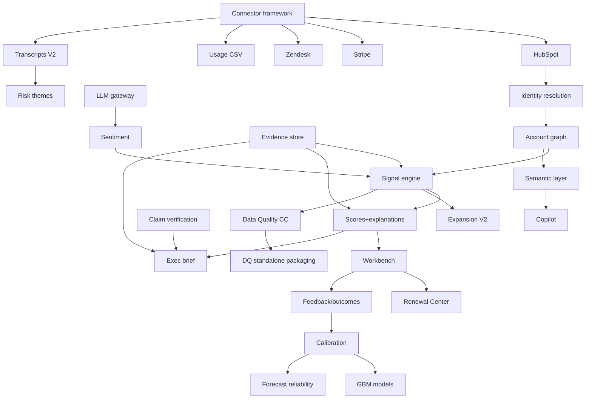

# 17. Roadmap Through Enterprise Expansion

## 17.1 Phases

### MVP (months 0–3.5) — "Renewal Risk Intelligence"
Doc 16. Wedge live with design partners.

### V1 (months 4–7) — "Trustworthy at first paid scale"
- Second CRM (Salesforce incl. field history → stage/slip signals), Intercom (2nd support), Chargebee (2nd billing).
- Investigation Copilot v1 (D.12 semantic layer, read-only, eval-gated).
- Account-plan generator + QBR prep packs (D.6/D.8).
- Stakeholder map + relationship-strength score; R1/R2/R4/R7 signals; champion-departure detection.
- SAML + SCIM, field-level policies, export controls; audit search UI.
- External task sync (Jira/Asana or CRM tasks GA); playbook builder v1.
- Isotonic calibration activation path (≥50 outcomes); precision/outcome dashboards GA; postmortem workflow.
- Data Quality Command Center v1 (full issue classes, remediation workflow).

### V2 (months 8–12) — "Expansion + conversation intelligence ingestion"
- Gong/Chorus/Zoom transcript connectors; S4/C6/C7 signals GA with review workflow; risk-theme extraction (D.2).
- Expansion Intelligence module (F) GA; expansion briefs + approval-gated draft opportunities.
- Warehouse connectors (Snowflake/BigQuery) + dbt package; Census/Hightouch inbound.
- GBM risk model activation path (≥200 outcomes, backtest gate); survival-model prototype for risk timing.
- Scenario modeling, cohort analysis, win-back tracking in Renewal Center.
- Google/Microsoft engagement metadata connector (meetings/email metadata; bodies still opt-in only).
- SOC 2 Type I report; pen test #2; EU region beta.

### Enterprise expansion (months 12–24)
- Forecast Reliability module (G) GA — enters VP Sales budget line.
- Data Quality Command Center standalone packaging (RevOps land motion #2).
- Gainsight/Totango import (coexist-then-replace motion), Outreach/Salesloft, CLM/DocuSign term extraction, ERP billing.
- SOC 2 Type II; private tenancy; BYOK; EU GA; access reviews automation.
- Privacy-safe cross-tenant benchmarks (k≥10, contractual opt-in) — only if customer pull is real.
- Exec mobile-web polish; API/webhook platform maturity (partner ecosystem).

## 17.2 Dependency map

Build order follows the arrows; nothing on the right ships before its left dependencies are trustworthy — **calibration before ML, evidence before generation, review workflow before transcript-derived signals.**

## 17.3 Kill / pivot criteria

| Checkpoint | Signal to kill/pivot |
|---|---|
| End of pilots (m4) | <50% alert acceptance AND no saved-renewal attribution → wedge fails; evaluate DQ-first pivot |
| m8 | Paid conversion <40% of pilots or sales cycle >150 days repeatedly → pricing/ICP wrong |
| m12 | NRR of RIG itself <100% or logo churn >15% → product not habit-forming; halt expansion modules, fix core |
| Any time | A hallucination/verification failure causes customer-visible exec misinformation → feature freeze on generation until root-caused (trust is the moat; defend it over roadmap) |
