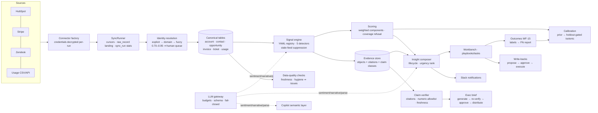

# Execution Doc 1 — Technical Architecture Document

Audience: the founding engineering team. Everything marked ✅ exists in this
repo and is test-enforced; ⏳ is the committed next step. File paths are real.

## 1. Tech stack (decided, with escape hatches)

| Layer | Decision | Status | Swap trigger |
|---|---|---|---|
| Frontend | React 18 + TypeScript + Vite, TanStack Query, plain-CSS tokens (`frontend/src/styles.css`) | ✅ | Adopt Tailwind+Radix when a 2nd frontend dev joins |
| Backend API | Python 3.11 + FastAPI, modular monolith (`backend/rig/`) | ✅ | Split connector runtime first, at >10 tenants syncing hourly |
| Database | Postgres 16, **RLS as the isolation backbone**, SQL-first migrations (`backend/migrations/*.sql`, ordered runner `rig/migrate.py`) | ✅ | Aurora when managed HA needed; never drop RLS |
| Analytics/events | Postgres `usage_metric_daily` (serving aggregates) | ✅ | ClickHouse when raw event volume >10⁸ rows (doc 13) |
| Queue/orchestration | Synchronous in-request sync (MVP) → **Temporal Cloud** for backfills/schedules | ⏳ | Adopt before the 3rd concurrent design partner |
| Connector framework | In-house `SyncRunner` + `Connector` protocol (`rig/connectors/base.py`): cursors, raw landing, failure capture | ✅ | — |
| Credentials | Fernet at-rest (`rig/credentials.py`), key enforced at boot | ✅ | KMS envelope (same column, no schema change) at SOC 2 Type I |
| LLM gateway | In-house (`rig/llm/gateway.py`): budgets, schema validation, fail-closed retry, run registry, cache; Anthropic SDK client (`claude-opus-5`, structured outputs, refusal fallback) | ✅ | Add per-task small-model routing when evals allow |
| Auth | Dev JWT (env-gated) → WorkOS OIDC/SAML/SCIM behind the same `decode_token` seam (`rig/auth.py`) | ⏳ wk1–2 | — |
| Rate limiting | Per-principal token buckets, cost-classed (`rig/ratelimit.py`) | ✅ | Redis buckets at multi-worker |
| Deploy | Single container: SPA served by FastAPI, boot gate + demo seed (`Dockerfile`, `rig/boot.py`) | ✅ | Split web/worker at Temporal adoption |
| CI | GitHub Actions: pytest (102) + tenant-isolation leak gate + zero-hallucination gate + frontend type-check/build | ✅ | — |

## 2. Multi-tenant isolation strategy

Three enforced layers — none is "be careful in app code":

1. **Row-level security**: every tenant table has `ENABLE` + `FORCE ROW LEVEL
   SECURITY` with policy `tenant_id = current_tenant()`; `current_tenant()`
   reads a transaction-local GUC set only by `tenant_session(tenant_id)`
   (`rig/db.py`) from the verified JWT. There is no code path that opens a
   tenant-data session without a tenant id.
2. **Role separation**: the app connects as `rig_app` — non-superuser,
   non-owner (superusers bypass RLS; this is the trap). Migrations use the
   admin URL. Audit UPDATE/DELETE is revoked *and* trigger-blocked.
3. **The leak gate** (`tests/test_rls_isolation.py`): CI attempts cross-tenant
   reads, writes, and known-ID probes on every table, and **fails the build if
   any table with a `tenant_id` column is missing from the gate list** — new
   tables cannot silently ship unprotected.

LLM/tenant boundary: retrieval and prompt assembly take a tenant-scoped
session; per-tenant token budgets; fitted calibration models are tenant rows
under RLS like everything else (proven in `test_calibration.py`).

## 3. Data pipeline



## 4. Connector API design

**Internal contract** (`rig/connectors/base.py`) — every connector implements:

```python
class Connector(Protocol):
    source_system: str
    streams: list[str]                      # ordered; e.g. ["companies","contacts","deals"]
    def fetch(stream, cursor) -> Iterable[SourceRecord]   # incremental after cursor
    def apply(session, tenant_id, record) -> ApplyResult  # idempotent upsert; outcomes:
        # created | updated | linked | queued | deferred | skipped
```

Rules the framework guarantees: raw payload landed before apply (replay
without re-fetch); per-stream watermark persisted only on success; a thrown
stream marks the run `failed` + source `action_required`; **secondary sources
never mint accounts** — unmatched records defer and auto-attach after a human
resolves the identity candidate.

**Admin REST surface** (all audited; secrets never returned):

| Endpoint | Behavior |
|---|---|
| `POST /v1/admin/sources` | `{type, name, credentials{...}, config{}}` → 201; per-type field validation; secret-shaped keys in `config` → 422; duplicate active name → 409; disconnected same-name → reactivates (`reconnected: true`) |
| `POST /v1/admin/sources/{id}/sync` | Runs now; 200 summary `{mode, stats{stream:{outcome:n}}}`; connector failure → **502** with summary; undecryptable creds → 409 "re-enter" |
| `GET /v1/admin/sources` | Cards with cursors + last-run rollup |
| `DELETE /v1/admin/sources/{id}` | Disconnect: credentials deleted, data retained (purge = WF-20) |
| `POST /v1/admin/usage/import` | CSV body ≤10MB → validation report `{status, imported, errors[]}` — partial commit of valid rows |

Per-source required credentials (single source of truth:
`rig/connectors/factory.py::REQUIRED_FIELDS`): hubspot `access_token` ·
stripe `api_key` · zendesk `subdomain, email, api_token`.

## 5. Authentication & authorization

- **Now**: HS256 JWT `{sub, tenant_id, role}`; dev token endpoints 404 unless
  `RIG_DEV_LOGIN=1`; production boot **refuses** the default secret.
- **Weeks 1–2**: WorkOS — OIDC first, SAML + SCIM behind the same
  `decode_token()` seam; enforced-SSO toggle per tenant; SCIM deprovision
  revokes within 5 min. No caller changes.
- **Authorization**: role → capability map (`rig/auth.py::CAPABILITIES`),
  enforced by `require("<capability>")` dependencies — UI only hides, server
  always enforces (403s tested).

| Capability | org_admin | data_admin | model_admin | leader | contributor | analyst | exec_readonly | audit_viewer |
|---|---|---|---|---|---|---|---|---|
| accounts:read | ✓ | ✓ | ✓ | ✓ | ✓ | ✓ | ✓ | |
| accounts:write | | | | ✓ | ✓ | | | |
| admin:evaluate | ✓ | ✓ | ✓ | ✓ | | | | |
| sources:manage | ✓ | ✓ | | | | | | |
| scores:configure | | | ✓ | | | | | |
| writeback:approve | ✓ | ✓ | | ✓ | | | | |
| signals:review | ✓ | | ✓ | ✓ | ✓ | | | |
| audit:read | ✓ | | | | | ✓ | | ✓ |
| users:manage | ✓ | | | | | | | |

Scope grants (team/territory/named-account, doc 4) layer onto this in V1.

## 6. Audit logging — schema & retention

Actual DDL (`migrations/0001_init.sql`):

```sql
CREATE TABLE audit_event (
  seq BIGSERIAL PRIMARY KEY, id UUID NOT NULL,
  tenant_id UUID NOT NULL,
  actor_type TEXT NOT NULL,      -- user | system | connector | model
  actor_id TEXT NOT NULL,
  action TEXT NOT NULL,          -- dotted taxonomy, e.g. writeback.execute
  object_type TEXT, object_id TEXT,
  payload JSONB NOT NULL DEFAULT '{}',   -- redacted: field NAMES for secrets, never values
  occurred_at TIMESTAMPTZ NOT NULL DEFAULT now(),
  prev_hash TEXT NOT NULL, hash TEXT NOT NULL   -- per-tenant chain, computed by trigger
);
-- append-only: UPDATE/DELETE blocked by trigger AND revoked from rig_app
```

Action taxonomy in production today: `account.view`, `signals.evaluate`,
`signal.review`, `insight.transition`, `playbook.apply`, `task.complete`,
`writeback.propose|approve|reject|execute|failed`, `brief.generate|
approve_blocked|approve|distribute`, `copilot.ask`, `source.create|reconnect|
sync|disconnect`, `identity.candidate.accept|reject`, `outcome.record`,
`calibration.fit`, `data_quality.run`, `usage.csv_import`, `tenant.seeded`.

Chain integrity: `hash = SHA256(prev_hash ‖ canonical fields)` computed by an
in-DB trigger under a per-tenant advisory lock; `rig/audit.py::verify_chain`
re-walks it. **Retention**: 7 years, never user-deletable; weekly chain
verification job + daily anchor hash to WORM storage land with SOC 2 prep
(execution doc 5). Payload policy: no secret values, no transcript excerpts —
IDs and enums only.
